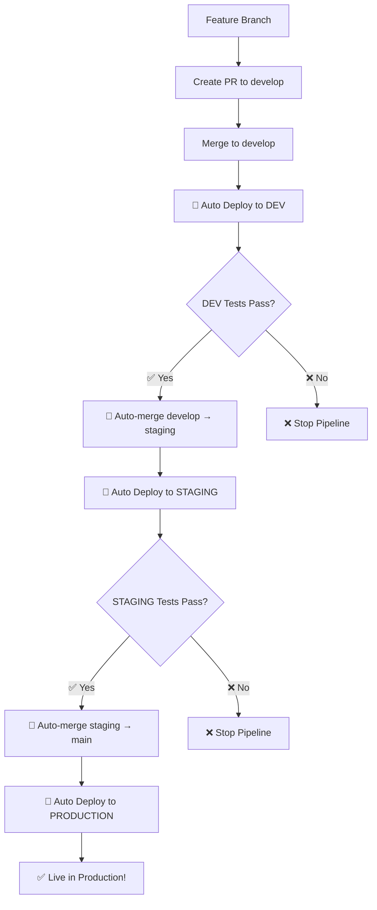

# 🚀 Fully Automated Deployment Pipeline

## 🎯 Complete Auto-Promotion Flow

Your deployment pipeline is now **100% automated** with no manual approval gates!

### 📋 Workflow Overview



### 🎪 Your Development Workflow

1. **Create Feature Branch:**
   ```bash
   git checkout develop
   git pull origin develop
   git checkout -b feature/awesome-new-feature
   # Make your changes
   git add .
   git commit -m "feat: awesome new feature"
   git push origin feature/awesome-new-feature
   ```

2. **Create PR and Merge to develop**
   - GitHub PR from `feature/awesome-new-feature` → `develop`
   - Review and merge

3. **Sit Back and Watch the Magic! ✨**
   ```
   develop → DEV environment (automatic)
   ↓ (if tests pass)
   develop → staging branch (automatic)
   ↓
   staging → STAGING environment (automatic)
   ↓ (if tests pass)  
   staging → main branch (automatic) ← NO APPROVAL NEEDED!
   ↓
   main → PRODUCTION environment (automatic)
   ```

### 🌐 Environment URLs

After deployment, your game will be available at:

- **DEV:** `https://game-2048-dev.game-2048-dev.dev.wa.darknex.us`
- **STAGING:** `https://game-2048-staging.game-2048-staging.staging.wa.darknex.us`  
- **PRODUCTION:** `https://game-2048-prod.game-2048-prod.wa.darknex.us`

### 🔍 Pipeline Monitoring

Monitor your deployments in:
1. **GitHub Actions** tab - see all workflows
2. **Webhook Handler Logs:**
   ```bash
   kubectl logs -n webhook-system -l app=webhook-handler -f
   ```
3. **Knative Service Status:**
   ```bash
   # Dev
   kubectl get ksvc -n game-2048-dev
   
   # Staging  
   kubectl get ksvc -n game-2048-staging
   
   # Production
   kubectl get ksvc -n game-2048-prod
   ```

### ⚡ Quick Test

Want to test the pipeline? Make a small change:

```bash
git checkout develop
# Edit any file in src/
git add .
git commit -m "test: trigger full pipeline"
git push origin develop
```

Then watch as your change automatically flows through DEV → STAGING → PRODUCTION! 🎉

### 🛡️ Safety Features

Even though it's fully automated, you still have safety checks:
- **Comprehensive testing** at each stage
- **Health checks** before promotion
- **SSL certificate validation**
- **Content validation**
- **Performance testing**
- **Automatic rollback** if any stage fails

### 🎮 Ready to Ship!

Your pipeline is now ready for:
- ✅ Continuous deployment
- ✅ Feature flags via environment badges
- ✅ Multi-environment testing
- ✅ Zero-downtime deployments
- ✅ Automatic scaling
- ✅ Full observability

Happy coding! 🚀
