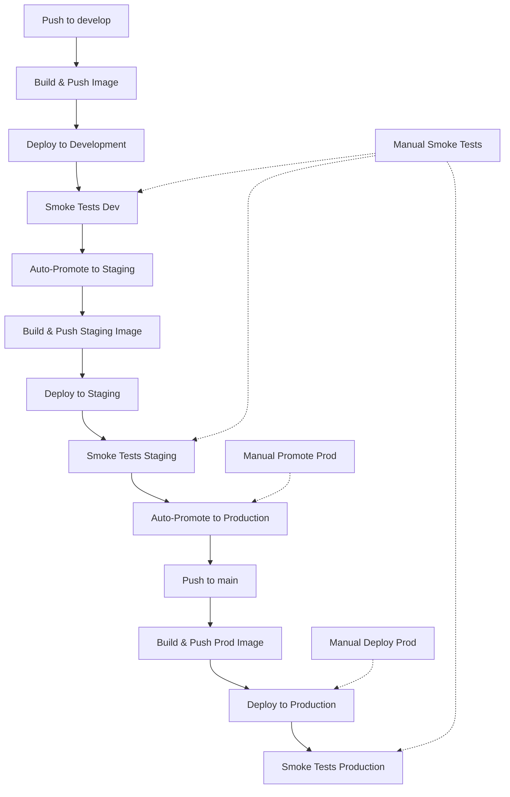

# 🔄 CI/CD Pipeline Documentation

This document describes the complete automated deployment pipeline for the Knative 2048 Game on k3s.

## 📋 Table of Contents

- [Pipeline Overview](#pipeline-overview)
- [Workflow Details](#workflow-details)
- [Manual Actions](#manual-actions)
- [Environment Configuration](#environment-configuration)
- [Troubleshooting](#troubleshooting)

## 🎯 Pipeline Overview

### Complete Automatic Flow



### Key Principles

- **Fully Automatic**: Zero manual intervention from develop to production
- **No Race Conditions**: Each step waits for the previous to complete
- **Test After Deploy**: Smoke tests run on newly deployed versions
- **Commit-Specific Images**: Each environment uses exact commit-tagged images
- **Automatic Promotion**: Successful tests trigger automatic promotion
- **Manual Override**: Emergency manual deployment still available

## 🔧 Workflow Details

### 1. Build and Push Container Image (`build-image.yml`)

**Triggers:**
- Push to `main`, `develop`, `staging`
- Pull requests to these branches

**What it does:**
- Builds Docker image from current commit
- Creates commit-specific tags: `{branch}-{commit-hash}`
- Pushes to GitHub Container Registry (GHCR)
- Provides foundation for all deployments

**Tags created:**
- `develop-abc1234` (for develop branch)
- `staging-def5678` (for staging branch) 
- `main-ghi9012` (for main branch)

### 2. Deploy to Development (`deploy-dev.yml`)

**Triggers:**
- After "Build and Push Container Image" completes successfully on `develop`
- Manual dispatch

**What it does:**
- Waits for build to complete (no race conditions)
- Uses exact commit-tagged image that was just built
- Deploys via webhook to k3s development namespace
- Sets up development environment

**Dependencies:**
- Requires successful build completion
- Uses environment secrets: `DEV_WEBHOOK_URL`, `WEBHOOK_SECRET`

### 3. Smoke Tests (`smoke-test.yml`)

**Triggers:**
- After any deployment completes ("Deploy to Development", "Deploy to Staging", "Deploy to Production")
- Scheduled every 6 hours
- Manual dispatch

**What it does:**
- Tests the **newly deployed** version (not previous)
- Validates canonical Knative domains
- Checks content, performance, SSL certificates
- Runs environment-specific tests

**Environments tested:**
- 🧪 Development: Your configured development domain
- 🎭 Staging: Your configured staging domain  
- 🚀 Production: Your configured production domain

### 4. Auto-Promote Pipeline (`auto-promote.yml`)

**Triggers:**
- After "Smoke Tests" complete successfully on `develop` branch

**What it does:**
- Verifies development smoke tests passed
- Merges `develop` → `staging` automatically
- Triggers staging deployment pipeline
- Creates promotion summary

**Safety features:**
- Only runs if smoke tests pass
- Handles "already up to date" scenarios gracefully

### 5. Deploy to Staging (`deploy-staging.yml`)

**Triggers:**
- Push to `staging` branch (triggered by auto-promotion)
- After "Auto-Promote Pipeline" completes
- Manual dispatch

**What it does:**
- Builds and deploys staging-specific image
- Uses `staging-{commit}` tagged image
- Deploys via webhook to k3s staging namespace

### 6. Auto-Promote to Production (`promote-to-production.yml`)

**Triggers:**
- After "Smoke Tests" complete successfully on `staging` branch (AUTOMATIC)
- Manual dispatch (emergency override only)

**What it does:**
- Verifies staging smoke tests passed
- Merges `staging` → `main` automatically
- Triggers production deployment immediately
- Creates production promotion summary

**Automation features:**
- Runs automatically after staging tests pass
- No manual confirmation required
- Seamless promotion from staging to production

### 7. Deploy to Production (`deploy-prod.yml`)

**Triggers:**
- Push to `main` branch (triggered by auto-promotion) - AUTOMATIC
- Manual dispatch (requires typing "DEPLOY" for emergencies)

**What it does:**
- Automatically deploys when main branch is updated
- Uses `main-{commit}` tagged image
- Deploys via webhook to k3s production namespace
- Blue-green deployment strategy for zero downtime

**Automation features:**
- No manual confirmation required for automatic deployments
- Immediate deployment after staging promotion
- Manual override still available for emergencies

### 8. Deployment Status Check (`deployment-status.yml`)

**Triggers:**
- Manual dispatch
- Scheduled every 4 hours

**What it does:**
- Checks health of all environments
- Shows current versions deployed
- Provides manual action options
- Creates comprehensive status report

## 🎮 Manual Actions (Emergency Use Only)

> **Note**: The pipeline is fully automatic. Manual actions are only for emergency situations or debugging.

### Emergency Actions

| Action | Workflow | Required Input | Use Case |
|--------|----------|----------------|----------|
| Check Status | Deployment Status Check | None | Monitor all environments |
| Test Environment | Smoke Tests | Environment (`dev`/`staging`/`prod`/`all`) | Debug specific environment |
| Emergency Deploy | Deploy to Production | Type "DEPLOY" | Emergency production fix |
| Force Promotion | Auto-Promote to Production | None | Skip normal promotion flow |

### Emergency Procedures

#### Emergency Production Deployment
**Use only if automatic pipeline is broken**
1. Go to Actions → "Deploy to Production"
2. Click "Run workflow"
3. Type "DEPLOY" in confirmation field
4. Optionally specify image tag
5. Click "Run workflow"

#### Force Production Promotion
**Use only if auto-promotion fails**
1. Go to Actions → "Auto-Promote to Production"
2. Click "Run workflow" 
3. Optionally skip tests if staging already validated
4. Click "Run workflow"

#### 3. Check Deployment Status
1. Go to Actions → "Deployment Status Check"
2. Click "Run workflow"
3. View results in workflow summary

#### 4. Run Smoke Tests
1. Go to Actions → "Smoke Tests"
2. Click "Run workflow"
3. Select environment to test
4. Click "Run workflow"

## ⚙️ Environment Configuration

### Required Secrets

| Secret | Purpose | Used By |
|--------|---------|---------|
| `GH_TOKEN` | GitHub Container Registry access | Build workflows |
| `WEBHOOK_SECRET` | Webhook signature validation | All deployment workflows |
| `DEV_WEBHOOK_URL` | Development deployment endpoint | Deploy to Development |
| `STAGING_WEBHOOK_URL` | Staging deployment endpoint | Deploy to Staging |
| `PROD_WEBHOOK_URL` | Production deployment endpoint | Deploy to Production |
| `DEV_DOMAIN` | Development domain suffix | Smoke Tests |
| `STAGING_DOMAIN` | Staging domain suffix | Smoke Tests |
| `PROD_DOMAIN` | Production domain suffix | Smoke Tests |

### Environment URLs

| Environment | Canonical Domain |
|-------------|------------------|
| Development | `https://${DEV_CANONICAL_DOMAIN}` |
| Staging | `https://${STAGING_CANONICAL_DOMAIN}` |
| Production | `https://${PROD_CANONICAL_DOMAIN}` |

### Image Tagging Strategy

| Branch | Tag Format | Example | Environment |
|--------|------------|---------|-------------|
| develop | `develop-{commit}` | `develop-abc1234` | Development |
| staging | `staging-{commit}` | `staging-def5678` | Staging |
| main | `main-{commit}` | `main-ghi9012` | Production |

## 🔍 Troubleshooting

### Common Issues

#### Pipeline Not Triggering

**Symptoms:** New commit pushed but no workflows start
**Causes:**
- Workflow file syntax error
- Missing required secrets
- Branch protection rules blocking

**Solutions:**
1. Check workflow syntax in `.github/workflows/`
2. Verify all secrets are set in repository settings
3. Check Actions tab for error messages

#### Deployment Fails

**Symptoms:** Deployment workflow fails
**Causes:**
- Webhook endpoint unreachable
- Invalid webhook signature
- k3s cluster issues
- Image not found

**Solutions:**
1. Check webhook handler logs: `kubectl logs -n webhook-system deployment/webhook-handler`
2. Verify webhook secret matches between GitHub and cluster
3. Confirm image exists in GHCR
4. Check k3s cluster health

#### Smoke Tests Fail

**Symptoms:** Tests report environment unreachable
**Causes:**
- DNS resolution issues
- SSL certificate problems
- Application not responding
- Ingress configuration issues

**Solutions:**
1. Test domains manually: `curl -I https://${DEV_CANONICAL_DOMAIN}`
2. Check Knative service status: `kubectl get ksvc -A`
3. Verify ingress configuration: `kubectl get ingress -A`
4. Check certificate status: `kubectl get certificates -A`

#### Auto-Promotion Not Working

**Symptoms:** Tests pass but promotion doesn't happen
**Causes:**
- Workflow permission issues
- No new commits to merge
- Dependency chain broken

**Solutions:**
1. Check workflow permissions in repository settings
2. Verify branch protection rules
3. Check workflow run logs in Actions tab
4. Manual promotion as fallback

### Debug Commands

```bash
# Check all environments
kubectl get all -A | grep game-2048

# Check webhook handler
kubectl logs -n webhook-system deployment/webhook-handler --tail=50

# Check Knative services
kubectl get ksvc -A

# Check ingress
kubectl get ingress -A

# Test webhook endpoint
curl -X POST -H "Content-Type: application/json" \
  -d '{"test": "true"}' \
  https://your-webhook-url/webhook

# Check DNS resolution
dig ${DEV_CANONICAL_DOMAIN}

# Test SSL certificate
openssl s_client -servername ${DEV_CANONICAL_DOMAIN} \
  -connect ${DEV_CANONICAL_DOMAIN}:443
```

### Emergency Procedures

#### Rollback Production
1. Identify last known good commit/tag
2. Run "Deploy to Production" manually
3. Specify the good image tag
4. Type "DEPLOY" to confirm

#### Skip Failed Tests
1. Run "Promote to Production" manually
2. Type "PROMOTE" to confirm
3. Enable "Skip tests" if staging already validated

#### Force Promotion
1. Manually merge branches using git
2. Push to trigger deployments
3. Monitor via "Deployment Status Check"

---

## 📚 Related Documentation

- [Environment Setup](docs/ENVIRONMENT.md)
- [Webhook Deployment](docs/WEBHOOK_DEPLOYMENT.md)
- [Setup Guide](docs/SETUP.md)
- [Branching Strategy](docs/BRANCHING.md)

---

*Last updated: 2025-01-01 16:00:00 UTC*
